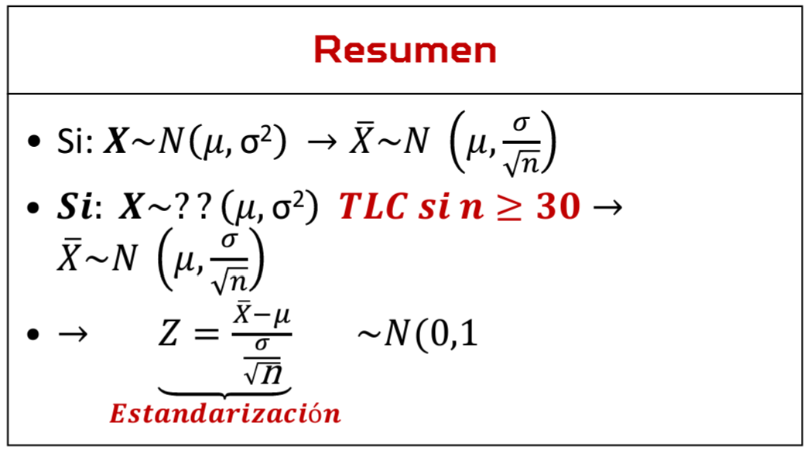
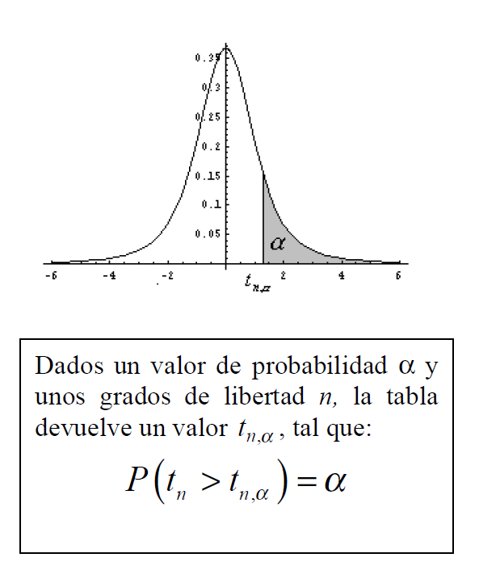
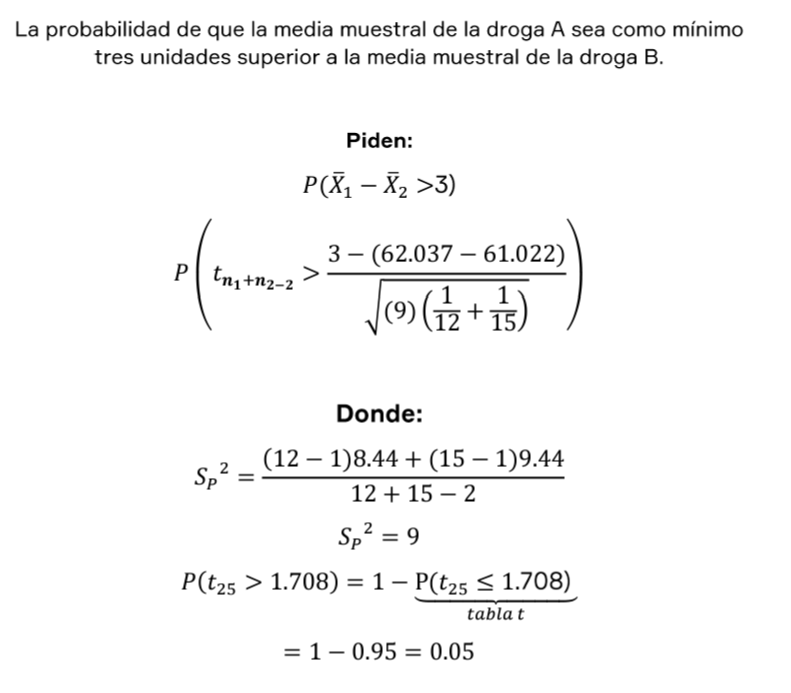
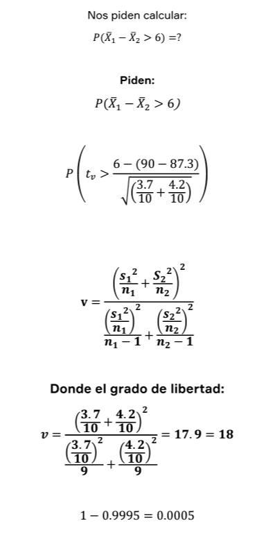

# Estadistica Inferencial (Introducción)
Nos proporcionan la teoria a partir de resultados o conclusiones de una muestra para inferir o estimar leyes de una poblacion.

## Parametro
Caracteristica numerica de una poblacion

## Estadistico
Caracteristica numerica de una muestra

## Observaciones 
Valor que toman las variables en cada elemento de la poblacion

## Unidad de analisis
Elemento u objeto indivisible que sera estudiado.

## Marco de muestreo
Relacion de unidades de muestreo

## Muestra
Conjunto de unidades de muestreo obtenidads del marco de muestreo.

---
## Variable 
Es una caracteristica de un objeto que tiende a ser cualitavia o cuantitativa.

---
###     Variable Cualitativa
####    Nominal
No se pueden ordenar
####    Ordinal
Tienen un orden, ya sea mayor que,menor que o igual que.

---
###     Variable Cuantitativa
####    Discreta
Solo se toman valores enteros
####    Continua
Se toman valores reales

---
## Ejemplo 1
La empresa Tecnotic SAC, está constituida por 860 ingenieros de sistemas,
distribuidos en (09) áreas laborales, la edad promedio de los ingenieros es 24
años, el 52% es de sexo masculino. Se tomó una muestra representativa de 100
ingenieros determinándose que 70%, trabajaban en dos turnos, además estos
tienen un sueldo promedio de S/. 4500. Se pide determinar:

**Poblacion:**
N = 860
 
**Muestra:**
 n = 100

**Unidad de analisis:**
Un ingeniero

**Variables:**
X = sueldo del ingeniero (V.Cuantitativa Continua)

**Dato:**
x1 = monto de sueldo de un ingeniero de la muestra

**Parametro:**
µ = Sueldo promedio de todos los ingenieros de la empresa

**Estadistico:**
Sueldo promedio de todos los ingenieros de la empresa

# Tipos de muestreo
* Muestreo aleatorio simple
* Muestreo sistematico
* Muestreo Estratificado

## Muestreo Aleatorio Simple

Simplemente se escoje un dato al azar, se puede uzar la formula +ALEATORIO.entre() en excel

```python 
# Ejemplo de selecion al azar con un arreglo
# Se utilizo el modulo random
import random

# Se crea la lista de numeros
datos = [15,16,4,7,4]

# Se declaran los rangos y se genera el numero al azar
valorMinimo=1
valorMaximo=5
numeroRandom =  random.randint(valorMinimo,valorMaximo)

# Se ubica al dato con el valor generado
datoValor = datos[numeroRandom-1]
print("Numero aleatorio:",numeroRandom)
print("Valor del numero aleatorio:",datoValor)

# Tambien se puede elegir directamente de la lista, si no
# se cuenta con un rango.

elementoAzar = random.choice(datos)
print("Elemento aleatorio directo:",elementoAzar)
```
## Muestreo sistematico

**Se debe definir el tamaño de la poblacion y la muestra**

N -> Poblacion
n -> Muestra

**Se define el valor K**

K -> N/n

**Elejimos un valor aleatorio entre 1 y K**

valorAleatorio = random.randint(1,k)

**Se declaran los siguientes valores**

Primera Seleccion = K
Frecuencia = valorAleatorio
Segunda selecion y posteriores = k + valorAleatorio

## Muestreo Estratificado

**Se debe contar con las varibales en porcentaje**

Ejemplo:
Genero | Masculino | 49%

**Se debe multiplicar el porcentaje por el tamaño de la muestra**

Ejemplo:
n = 30
valorMuestreo = 30 * 0.49 = 14.7 ≈ 15


## Tablas estadisticas

* **Tabla de distribucion normal:**

    Para utilizar esta tabla se debe tomar los valores y ubicarlos por fila y columna. 
    
    Se hace los mismo con los valores negativos
    
    Ejemplo:

    $$P(Z>-1.37)$$
    Se ubica el valor en la tabla

    $$1.37 = 0.08534$$
    
    Luego se realiza la siguiente operacion:

    $$Z=1-0.8534=0.91466$$

    **Propiedades:**

$$P(Z<a)=P(Z<a)$$
$$P(Z>a)=1-P(Z<=a)$$
$$P(a<Z<b)=P(Z<b)-P(Z<a)$$

* **Tabla T-Student**

Se aproxima a la normal cada vez que aumentan los grados de libertad. 

Se debe tomar en cuenta el tamaño de la muestra **n** para obtener los grados de libertad **gl**
$$gl=n-1$$

**Primera Hipotesis**

Para usar la tabla se debe hallar el valor  **t** , este valor se encontrara en la fila que coincida con el valor **gl** calculado. Se obtendra como resultado el valor de la columna.

**Segunda Hipotesis** (Despues de ver el video)

Se tienen los siguientes datos:

Nivel de Confianza $NC$= 95% | $Tα/2$ | muestra **n=11**

---
Se calcula la probabilidad
$$NC+α=1$$
$$0.95+α=1$$
$$α=0.05$$
Nos piden $α/2$ entonces: 
$$α/2=0.025$$

Ahora $Tα/2$

$$Tα/2=1-α/2$$
$$Tα/2=1-0.025$$
$$Tα/2=0.975$$

Luego se calcula los grados de libertad
$$gl=n-1$$
$$gl=11-1$$
$$gl=10$$
---
Ahora se ubica en la tabla intersectando los grados de libertad y probabilidad.

>Si tenemos controlados los **gl** vamos a controlar tambien la distribucion.

# Tamaño de muestra


Cada nivel de confianza tiene su equivalencia en calificacion $Z$

Formulas:


**Se emplea la tabla Z cuando:**

* n $\geq$ 30 y $\sigma^2$ conocida.
* n $<$ 30 y $\sigma^2$ conocida.

No siempre es necesario calcular el nivel de confianza, he aqui una **tabla con los valores mas comunes:**

| Nivel de Confianza | Calificacion Z |
| :-: | :-:     |
| 0.90   | 1.645  | 
| 0.95   | 1.96  | 
| 0.98   | 2.33  |
| 0.99   | 2.575  |  

# Distribución Muestral
Se habla de la teoria del muestreo la cual consiste en inferir datos de la poblacion a travez de las muestras o estadisticos.

Una distribucion muestral se forma al obtener distintos parametros estadisticos como la desviacion estandar, la media etc...

**Para una muestra de una población finita:**
$$
\begin{aligned}\mu_{\bar{X}}&=\mu\\\sigma_{\bar{X}}&
=\frac\sigma{\sqrt{n}}\end{aligned}

$$
- $(\mu_{\bar{X}}$) es la media de la distribución muestral de la media.
- $(\sigma_{\bar{X}}$) es la desviación estándar de la distribución muestral de la media.
- $(\mu)$ es la media de la población.
- $(\sigma$) es la desviación estándar de la población.
- $(n$) es el tamaño de la muestra.


**Para una muestra de una población infinita o de una población finita cuando se extraen sin reemplazo:**
$$
\begin{aligned}
\mu_{\bar{X}} &= \mu \\
\sigma_{\bar{X}} &= \frac{\sigma}{\sqrt{n}} \sqrt{\frac{N-n}{N-1}}
\end{aligned}
$$
- $(\mu_{\bar{X}}$) es la media de la distribución muestral de la media.
- $(\sigma_{\bar{X}}$) es la desviación estándar de la distribución muestral de la media.
- $(\mu$) es la media de la población.
- $(\sigma$) es la desviación estándar de la población.
- $(n$) es el tamaño de la muestra.
- $(N$) es el tamaño de la población.
---
Si $N$ es demasiado grande con respecto a $n$ tal que $\frac{n}{N}\leq0.05$ entonces $\frac{N-n}{N-1}$ tiende a 1, por lo que esto no afecta a la generalidad.

### Ejercicio Explicativo
Los puntajes en el grado de satisfacción de un grupo de profesionales en el salario están normalmente distribuidos con una media de 56 y una desviación estándar de 16. ¿Cuál es la probabilidad de que una muestra aleatoria de 25 de estos profesionales arroje un puntaje promedio entre 55 y 58?

**Se tienen los siguientes datos:**

$\mu$ = 56

$\sigma$ = 16

$n$ = 25

Nos piden:
$P(55\leq X\leq58)$

En el problema se da a entender que la poblacion es normal por lo tanto se tiene que:

${\bar{X}}$ = 56

$\sigma_{\bar{X}}$ = $\frac{16}{\sqrt{25}}$ = 3.2

$$
\begin{gathered}
P(55\leq\bar{X}\leq58)=P(\frac{55-56}{3.2}\leq\frac{X-\mu}{\sigma_{\bar{X}}}\leq\frac{58-56}{3.2}) \\
=P(-0,31\leq Z\leq0.63) \\
=P(Z\leq0.63)-P(Z\leq-0.31) \\
=0.7357-0.3745 \\
\text{=0.3612} 
\end{gathered}
$$

La probabildad de que una muestra aleatorioa de 25 de estos profecionales arroje un puntaje promedio entre 55 y 58 es de 32.16%


# Distribucion muestral de medidas con varianza conocida



## Distribucion T-Student

**Condiciones de uso:**
* Se debe utilizar en muestras menores a 30 elementos.
* La desviacion estandar de la poblacion $(\sigma)$ es desconocida.
* La distribucion poblacion tiene que ser normal.

**Caracteristicas:**

* Es simetrica,con forma de campana con centro en 0.
* Areas de los extremos amplias a comparacion de la normal, porque se trabaja con muestras pequeñas.



* Grados de libertdad $gl$ : V = n - 1 , cuando V tiende a $\infty$ la curva T se aproxima a la Normal.

# Distribución de la diferencia de dos medias muestrales con varianza poblacional conocida.

Sean dos muestras aleatorias simples e independientes de tamaños.

$$
\bar{X}_1 - \bar{X}_2 \sim N\left(\mu_1 - \mu_2, \sqrt{\frac{\sigma_1^2}{n_1} + \frac{\sigma_2^2}{n_2}}\right)
$$

Estandarizacion:

$$
Z_{C}=\frac{\overline{(X_{1}}-\overline{X_{2}})-(\mu_{1}-\mu_{2})}{\sqrt{\frac{\sigma_{1}{}^{2}}{n_{1}}+\frac{\sigma_{2}{}^{2}}{n_{2}}}}\sim N(0,1)
$$

## Ejercicio Explicativo:

La empresa Industria SAC desea comparar los pesos promedio de los
cereales de trigo y cereales de maíz que produce, para tal motivo usa una
muestra aleatoria de 20 cereales de trigo y 25 de cereales de maíz, Se
sabe que tanto para los cereales de trigo como para los de maíz los pesos
siguen una distribución normal. El promedio de los pesos de todos los
cereales de trigo es de 100 libras y su desviación estándar es de 14.142,
mientras que el promedio de los pesos de todos los cereales de maíz es de
85 libras y su desviación estándar es de 12.247 libras. Encuentre la
probabilidad de que el promedio de los pesos de los cereales de trigo sea
al menos 20 libras más grande que el de maíz.

Los parámetros relevantes son:
- Para los cereales de trigo:
  - Promedio ($\mu_1$): 100 libras
  - Desviación estándar ($\sigma_1$): 14.142 libras
  - Tamaño de muestra ($n_1$): 20

- Para los cereales de maíz:
  - Promedio ($\mu_2$): 85 libras
  - Desviación estándar ($\sigma_2$): 12.247 libras
  - Tamaño de muestra ($n_2$): 25

La probabilidad que queremos encontrar es:
$$ P(\bar{X}_1 - \bar{X}_2 \geq 20) $$

Convertimos esto a la distribución estándar $Z$:
$$ P\left(Z \geq \frac{20 - (\mu_1 - \mu_2)}{\sqrt{\frac{\sigma_1^2}{n_1} + \frac{\sigma_2^2}{n_2}}}\right) $$

Sustituimos los valores:
$$ P\left(Z \geq \frac{20 - 15}{\sqrt{3.16^2 + 2.45^2}}\right) $$

Calculamos el valor numérico:
$$ P\left(Z \geq \frac{5}{\sqrt{9.9856 + 6.0025}}\right) $$

$$ P\left(Z \geq \frac{5}{\sqrt{15.9881}}\right) $$

$$ P\left(Z \geq \frac{5}{4}\right) $$
$$
\begin{aligned}P(Z\geq1.25)&=1-\underbrace{P(Z<1.25)}_{tabla}\\&P=1-0.89435\\&P=0.10565\end{aligned}
$$

# Distribución de la diferencia de dos medias muestrales con varianza poblacional desconocida

Cuando las varianzas Sean desconocidas, estas varianzas pueden ser homogeneas o heterogeneas.

**Caso a. Las varianzas poblacionales son desconocidas pero iguales:**

$$ 
{\sigma^{2}}_{1}={\sigma^{2}}_{2}={\sigma^{2}} 
$$

$$
T=\frac{\overline{(X_{1}}-\overline{X}_{2})-(\mu_{1}-\mu_{2})}{\sqrt{s_{P}{}^{2}\left(\frac{1}{n_{1}}+\frac{1}{n_{2}}\right)}}\sim t_{n_{1}+n_{2-2}}
$$

Tiene una distribucion t student con grado de libertad : $n1 + n2 - 2$

**Donde:**

$$
S_{P}{}^{2}=\frac{\left(n_{1}-1\right)S_{1}{}^{2}+\left(n_{2}-1\right)S_{2}{}^{2}}{n_{1}+n_{2}-2}
$$

## Ejercicio explicativo 2

Dos drogas, A y B, de las que se dice que reducen el tiempo de respuesta de las ratas a determinado estímulo, se están comparando en un experimento de laboratorio. El experimentador sabe que en las respectivas poblaciones los tiempos de respuesta al estímulo están distribuidos normalmente. Se administra la droga A a 12 ratas y la droga B a 15. Cuando se lleva a cabo el experimento, Ia reducción promedio de tiempo de respuesta al estímulo por parte de las ratas que están recibiendo la droga A es 62.037 milisegundos con una desviación típica de 8.44 milisegundos. Los datos correspondientes a Ia droga B son 61.022 y 9.44 milisegundos. ¿Cuál es la probabilidad de que de que la diferencia entre la reducción promedio de tiempo de respuesta al estímulo por parte de las ratas que están recibiendo la droga A y la de las ratas que están recibiendo la droga B sea como mínimo tres unidades mayor a la observada en el experimento?. Suponga que no hay diferencia alguna entre las dos drogas con respecto a la reducción promedio en tiempos de respuestas y que las drogas son igualmente efectivas.



# Distribución de la diferencia de dos medias muestrales con varianza

Las varianzas poblacionales son conocidas pero diferentes:

$$\sigma^2{}_1\neq\sigma^2{}_2$$

Tiene una distribucion T student con grado de libertad:

$$
T=\frac{\overline{(X}_1-\overline{X}_2)-(\boldsymbol{\mu}_1-\boldsymbol{\mu}_2)}{\sqrt{\frac{S_1}{n_1}+\frac{S_2}{n_2}}}
$$

**Donde:**

$$
\mathrm{v}=\frac{\left(\frac{s_1}{n_1}^2+\frac{S_2^2}{n_2}\right)^2}{\frac{\left(\frac{s_1}{n_1}^2\right)^2}{n_1-1}+\frac{\left(\frac{s_2^2}{n_2}\right)^2}{n_2-1}}
$$
## Ejercicio explicativo 3
Un equipo de psicólogos está investigando si existen o no diferencias entre dos métodos de relajación para reducir la ansiedad. Para lo cual se seleccionan dos muestras de tamaño 10 cada una, a las que se les aplicó el método **X** e **Y** respectivamente. Obteniéndose que las varianzas muestrales son de 3.7 y 4.2 puntos respectivamente. Suponiendo que las puntuaciones de ansiedad de ambas poblaciones siguen distribuciones muestrales con medias poblacionales de 90 y 87.3 puntos respectivamente y que las varianzas poblacionales son desconocidas pero se sabe que son diferentes. Hallar la probabilidad de la media muestral de puntuación del método **X** sea como mínimo 6 unidades mayor que el método **Y**.




