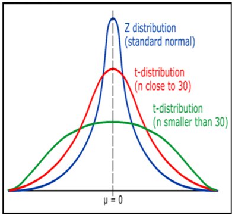
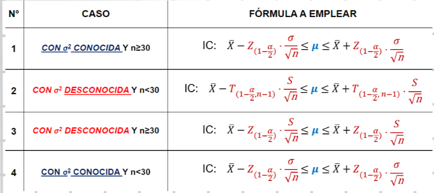
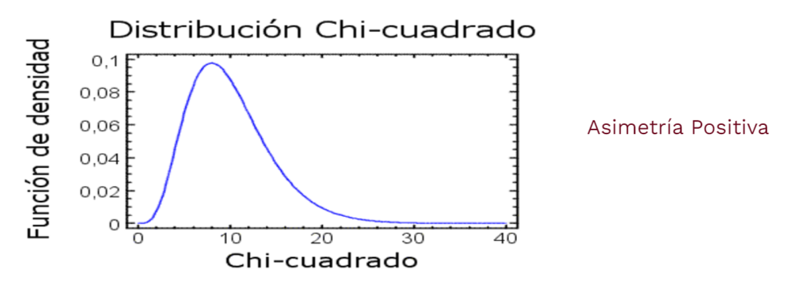

# Intervalo de confianza para la media

**Estimacion:**
Usar los estadisticos para estimar los parametros
### Tipos:

* **Puntual:** Se obtiene el parametro a partir de un solo numero obtenido de la muestra.
Cuando tenemos una media aritmetica a partir de una muestra (estadístico), esta puede ser empleada como estimador puntual para el valor de la media poblacional (parámetro). Análogamente con los demás estadísticos.

* **Por intervalos:** Se cuenta con un determinado rango de valores en los que se espera que esté el parametro (confianza) de que se encuentre el verdadero valor de $\theta$ (parámetro).
$$
P(\widehat{\theta}-\varepsilon<{\theta}<\widehat{\theta}+\varepsilon)={1-\alpha}
$$

# Intervalo de confianza de la media con varianza conocida

**Coeficiente o grado de confianza =** $1-\alpha$ 

Es la probabilidad de que la media $\mu$ este contenida en el **intervalo de confianza**

**Desconfianza o nivel de insignificancia** ( $\alpha$ )

Tambien llamado **error de tipo I** son sucesos fortuitos o extraños que pueden ocurrir.

---

**Emplearemos Z cuando:**

* $n\geq30$ y $\sigma^2$ (Varianza Poblacional) conocida
* $n<30$ y $\sigma^2$ (Varianza Poblacional) conocida

**Intervalo de confianza IC**

$$
IC{:}\quad\bar{X}-Z_{(1-\frac\alpha2)}\cdot\frac\sigma{\sqrt{n}}\leq\mu\leq\bar{X}+Z_{(1-\frac\alpha2)}\cdot\frac\sigma{\sqrt{n}}
$$

**Erorr** ( $\epsilon$ )

$$
|\bar{X}-\mu|\leq\frac{Z_{1-\frac\alpha2}\cdot\sigma}{\sqrt{\mathrm{n}}}
$$

# Intervalo de confianza de la media con varianza desconocida

**Caso A)**

**Emplearemos T :** Si tenemos una muestra aleatoria, poblacion normal, $n$ < 30 y $\sigma^2$ (Varianza Poblacional) desconocida. 

Para estos casos utilizamos la tabla t-student para tamaños de muestra $n$ < 30

**Formula:**
$$
\mathbf{T_{n-1}}={\frac{\overline{\mathbf{X}}-\mathbf{\mu}}{\frac{\mathbf{S}}{\sqrt{\mathbf{n}}}}}
$$

$$
{T_{(1-\frac\alpha2,gl)}}
$$

$$
\mathsf{IC}{:}\quad\bar{X}-T_{(1-\frac{\alpha}{2},gl)}\cdot\frac{S}{\sqrt{n}}\leq\mu\leq\bar{X}+T_{(1-\frac{\alpha}{2},gl)}\cdot\frac{S}{\sqrt{n}}
$$

* Como $\sigma2$ (Varianza Poblacional) no se conoce se estima con $S^2$ (Desviacion Estandar Muestral)
* La distribucion se desvia de forma notable cuando los grados de libertad $gl$ son pequeños.
* Los grados de libertad se pueden expresar asi : $(gl=n-1)$ o $(v=n -1)$
---
**Caso B)**

**Emplearemos Z :** Si $n$ >= 30 y $\sigma^2$ (Varianza Poblacional) desconocida.

---
**Imagen Resumen:**

# Intervalos de confianza para la diferencia de medidas muestrales con varianza conocida y desconocida

**Conocida:**

Si $X_1-X_2$ son las medias de dos muestras aleatorias independientes de tamaño $n_1-n_2$, tomadas de poblaciones que tiene **varianzas** $\sigma_1^2$ , $\sigma_2^2$ **conocidas** respectivamente, entonces el intervalo de confianza para $\mu_1 - \mu_2$ es:

$$
IC=(X_1-X_2)-Z_{(1-\frac{\alpha}{2})}\sqrt[]{\frac{\sigma_1{}^2}{n_1}+\frac{\sigma_2{}^2}{n_2}}\leq\boldsymbol{\mu_1}-\boldsymbol{\mu_2}\leq(X_1-X_2)+Z_{(1-\frac{\alpha}{2})}\sqrt[]{\frac{\sigma_1{}^2}{n_1}+\frac{\sigma_2{}^2}{n_2}}
$$

**Equivalente:**

$$
IC=(\mu_1-\mu_2)=\left[\bar{X}_1-\bar{X}_2\pm Z_{\left(1-\frac{\alpha}{2}\right)}\cdot\sqrt{\frac{\sigma_1{}^2}{n_1}+\frac{\sigma_2{}^2}{n_2}}\right]
$$

**Se usa Z cuando:**

| Muestras grandes | Muestras Pequeñas |
| :-: | :-: |
| ($n_1\geq 30, n_2\geq30$) | ($n_1<30,n_2<30$) |
| Varianzas conocidas $\sigma^2$ | Varianzas desconocidas $\sigma^2$ | 
| Poblaciones Normales o no | Poblaciones Normales |

**Interpretaciones Adicionales segun los intervalos obtenidos:**

$$
IC(\mu_1-\mu_2)
$$
$\mu_1$ : Limite Inferior

$\mu_2$ : Limite Superior

* Cuando los signos del límite inferior y superior son positivos, se concluye que el promedio de la población 1 es mayor al promedio de la población 2, si ambos son negativos, la poblacion 1 es menor al promedio de la poblacion 2.

---
**Desconocida:**

**Caso 1)**

* Muestras Pequeñas $n_1<30,n_2<30$)
* Varianzas poblacionales desconocidas pero iguales ${\sigma^{2}}_{1}={\sigma^{2}}_{2}={\sigma^{2}} $
* Poblaciones Normales

Se emplea la distribucion t-Student con $gl=n_1+n_2-2$

$$
{S_P}^2=\frac{(n_1-1){S_1}^2+(n_2-1){S_2}^2}{n_1+n_2-2}
$$

**Formula:**
$$
(X_{1}-X_{2})-T_{(1-\frac{\alpha}{2},gl)}\sqrt{S_{P}^{2}(\frac{1}{n_{1}}+\frac{1}{n_{2}})}\le\mu_{1}-\mu_{2}\le(X_{1}-X_{2})+T_{(1-\frac{\alpha}{2},gl)}\sqrt{S_{P}^{2}(\frac{1}{n_{1}}+\frac{1}{n_{2}})}
$$

**Caso 2)**

* Muestras Pequeñas $n_1<30,n_2<30$)
* Varianzas poblacionales desconocidas y diferentes $(\sigma_{1}{}^{2}\neq\sigma_{2}{}^{2})$
* Poblaciones Normales

Donde $T_{(1-\frac\alpha2)}$ es el valor de $T$ con $V$ grados de libertad.

$$
V = \frac{\left(\frac{S_1^2}{n_1} + \frac{S_2^2}{n_2}\right)^2}{\frac{\left(\frac{S_1^2}{n_1}\right)^2}{n_1-1} + \frac{\left(\frac{S_2^2}{n_2}\right)^2}{n_2-1}}
$$

**Formula:**
$$
(X_{1}-X_{2})-T_{(1-\frac{\alpha}{2},V)}\sqrt{S_{P}^{2}(\frac{1}{n_{1}}+\frac{1}{n_{2}})}\le\mu_{1}-\mu_{2}\le(X_{1}-X_{2})+T_{(1-\frac{\alpha}{2},V)}\sqrt{S_{P}^{2}(\frac{1}{n_{1}}+\frac{1}{n_{2}})}
$$

# Intervalos de confianza para la proporcion:

$$
IC=p-Z_{\left(1-\frac\alpha2\right)^\bullet}\sqrt{\frac{pq}n}<{\pi}<p+Z_{\left(1-\frac\alpha2\right)^\bullet}\sqrt{\frac{pq}n}
$$

A favor:
$$
p=\frac{X}{n}
$$
$X$ = Numero de exitos en la muestra o poblacion | $n$ = Tamaño de la muestra o poblacion.

En contra:
$$
q = 1 - p 
$$

* Nivel de Significancia = A = 1%, 2%...
* Nivel de confianza = 1 - A = 99%, 98%...

# Intervalos de confianza para la diferencia de proporciones

Si, $p1$ y $p2$ son dos proporciones muestrales de las observaciones de dos muestras aleatorias independientes de tamaño $n1$ y $n2$, que pertenecen a la clase de interés, entonces el intervalo de confianza de $100 (1-a)$ por ciento para la diferencia de verdaderas proporciones $p1-p2$, es:

$$
IC= {p_1-p_2-Z_{(1-\frac{\alpha}{2})}\sqrt{\frac{p_1q_1}{n_1}+\frac{p_2q_2}{n_2}}<\pi_1-\pi_2<p_1-p_2-Z_{(1-\frac{\alpha}{2})}\sqrt{\frac{p_1q_1}{n_1}+\frac{p_2q_2}{n_2}}}
$$

A favor:
$$
p=\frac{X}{n}
$$
$X$ = Numero de exitos en la muestra o poblacion | $n$ = Tamaño de la muestra o poblacion (Esto se repite para ambas muestras)

# Intervalos de confianza para la varianza

**Usos:**
* Calcular los intervalos de confianza y prueba para de hipotesis para la vairanza poblacional $\sigma^2$
* Para pruebas de bondad de ajuste es decir si un conjunto de datos sigue un distribucion predeterminada
* Para analisar tablas de contingencia

**Relacion entre variabilidad y calidad:** La calidad dependende de la variabilidad, a menor cantidad de variabilidad mayor calidad del producto.

La tabla Chi-cuadrado se relaciona con:
$$
X^2_{(\alpha;n-1)}
$$

**FORMULAS**

Intervalo de confianza para la varianza:
$$
\frac{(n-1)S^2}{X^2_{(1-\frac\alpha2,n-1)}}<\sigma^2<\frac{(n-1)S^2}{X^2_{(\frac\alpha2,n-1)}}
$$

Intervalo de confianza para disviacion estandar:
$$
\sqrt{\frac{(n-1)S^2}{X^2_{(1-\frac{\alpha}{2},n-1)}}}<\sigma<\sqrt{\frac{(n-1)S^2}{X^2_{(\frac{\alpha}{2},n-1)}}}
$$
