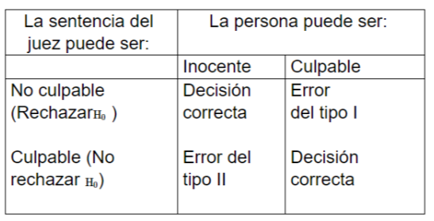

**Primeras impresiones:**
La prueba de hipotesis se utiliza para estimar la veracidad de una afirmacion acerca de una poblacion, para esto se necesitan los datos muestrales.

Las **hipotesis** son procedimientos que conducen a la aceptacion o rechazo de **hipotesis estadisticas** y estas son afirmaciones numericas acerca de una poblacion o muestra, existen dos **tipos** de hipotesis estadisticas tenemos la **nula** y **alternativa**.

* **Hipótesis Nula:** *(ES LA QUE SIEMPRE SE PRUEBA)* Se simboliza por $H_0$, hipótesis que se debe comprobar, afirmacion que niega toda diferencia entre dos poblaciones, parámetros poblacionales o entre el valor verdadero de algún parámetro y su valor hipotético.

* **Hipótesis Alternativa:** Simbolizada por $H_1$ es el "complemento" de la hipótesis nula y representa la
conclusión cuando $H_0$ se rechaza.

### Ejemplo
Una persona se le acusa del robo de un automóvil,razón por la cual es llevado ajuicio.

**Procedimiento:**

1. Se Detonan las Hipotesis:

    $H_0$: Esa persona robo el automovil.

    $H_1$: Esa persona no se robo el automovil.

2. Se pueden tomar las siguientes decisiones:

3. Decisiones:
    
    No culpable / Inocente = **Correcto**

    Culpable / Culpable = **Correcto**

    No culpable / Culpable = **Error 1** Se rechaza $H_0$ a pesar de ser verdadera.

    Culpable / Inocente = **Error 2** Se acepta $H_0$ a pesar de ser falsa.

# Pruebas de Hipotesis
 **Inicia** por una supocision entorno a un parametro ($\theta$) de la poblacion $Pn$. Estos parametros pueden ser: media ($\mu$), varianza($\sigma^2$), proporcion ($\pi$) entre otros.

**Luego** se reunen datos muestrales y producimos estadisticos para compromar que la hipotesis sea correcta

* **Hipótesis Nula:** Como se mantiene el efecto emplea los signos ($=,\geq,\leq$)

* **Hipótesis Alternativa:** Si hay cambio entonces ($\neq,<,>$)

Ambas Hipótesis se refieren a la misma poblacion $\mu,\sigma^2,\pi$

La prueba de Hipotesis nos puede dar los siguientes **resultados:**

1. Que la $H_0$ se rechaze y la $H_1$ se acepte:

$$
H_0:\theta=\theta_0
$$

2. Que no se rechaze $H_0$ en base a la evidencia:

$$
H_1:\theta\neq\theta_0
$$

**Importante:** No rechazar la Hipotesis nula no significa que sea valida, en este caso es falta de evidencia.

## Ejemplo para plantear Hipótesis
