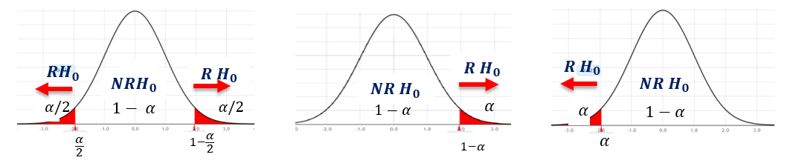

**Primeras impresiones:**
La prueba de hipotesis se utiliza para estimar la veracidad de una afirmacion acerca de una poblacion, para esto se necesitan los datos muestrales.

Las **hipotesis** son procedimientos que conducen a la aceptacion o rechazo de **hipotesis estadisticas** y estas son afirmaciones numericas acerca de una poblacion o muestra, existen dos **tipos** de hipotesis estadisticas tenemos la **nula** y **alternativa**.

* **Hipótesis Nula:** *(ES LA QUE SIEMPRE SE PRUEBA)* Se simboliza por $H_0$, hipótesis que se debe comprobar, afirmacion que niega toda diferencia entre dos poblaciones, parámetros poblacionales o entre el valor verdadero de algún parámetro y su valor hipotético.

* **Hipótesis Alternativa:** Simbolizada por $H_1$ es el "complemento" de la hipótesis nula y representa la
conclusión cuando $H_0$ se rechaza.

### Ejemplo
Una persona se le acusa del robo de un automóvil,razón por la cual es llevado ajuicio.

**Procedimiento:**

1. Se Detonan las Hipotesis:

    $H_0$: Esa persona robo el automovil.

    $H_1$: Esa persona no se robo el automovil.

2. Se pueden tomar las siguientes decisiones:

3. Decisiones:
    
    No culpable / Inocente = **Correcto**

    Culpable / Culpable = **Correcto**

    No culpable / Culpable = **Error 1** Se rechaza $H_0$ a pesar de ser verdadera.

    Culpable / Inocente = **Error 2** Se acepta $H_0$ a pesar de ser falsa.

# Pruebas de Hipotesis
 **Inicia** por una supocision entorno a un parametro ($\theta$) de la poblacion $Pn$. Estos parametros pueden ser: media ($\mu$), varianza($\sigma^2$), proporcion ($\pi$) entre otros.

**Luego** se reunen datos muestrales y producimos estadisticos para compromar que la hipotesis sea correcta

* **Hipótesis Nula:** Como se mantiene el efecto emplea los signos ($=,\geq,\leq$)

* **Hipótesis Alternativa:** Si hay cambio entonces ($\neq,<,>$)

Ambas Hipótesis se refieren a la misma poblacion $\mu,\sigma^2,\pi$

La prueba de Hipotesis nos puede dar los siguientes **resultados:**

1. Que la $H_0$ se rechaze y la $H_1$ se acepte:

$$
H_0:\theta=\theta_0
$$

2. Que no se rechaze $H_0$ en base a la evidencia:

$$
H_1:\theta\neq\theta_0
$$

**Importante:** No rechazar la Hipotesis nula no significa que sea valida, en este caso es falta de evidencia.

## Ejemplo para plantear Hipótesis
Una empresa de Marketing Industrial está considerando Ia introducción de un nuevo plan de servicio para piezas hidráulicas. El plan será presentado si se prefiere por más del 40% de los clientes:

*Lenguaje Estadistico:*

* $H_0:\pi\leq40$%
* $H_1:\pi\leq40$% ---> Lo que el investigador espera

Si se rechaza la Hipótesis nula $H_0$, se aceptará la alterna $H_1$ y se introducirá el nuevo servicio, si no se puede rechazar la hipótesis nula $H_0$, el nuevo plan de servicio no debería introducirse a menos que se obtenéa una evidencia adicional.

*Esta prueba tiene una dirección (mayor 40%), por lo tanto, es una prueba de una cola superior.*

---
### Tipos de Errores
* **Error Tipo I:** Rechazar una hipotesis nula cuando es verdadera, la probabilidad de cometer este error es $\alpha$ esto es llamado nivel de significancia.

* **Error Tipo II:** Aceptar una hipotesis nula cuando es falsa, la probabilidad de cometer este error es de $\beta$.

Potencia de prueba: Probabilidad de rechazar una hipotesis nula que es falsa $1-\beta$.

---
## Procedimiento para realizar una prueba de hipótesis

* **Plantear la hipotesis**

* **Fijar el nivel de significancia $\alpha$**

* **Identificar el estadistico de prueba $Z,T,X_2$**
    
    **Varianza poblacional Conocida ($\sigma$)**
    $$
    Z_c=\frac{\bar{x}-\mu_{\mathrm{hip}}}{\frac\sigma{\sqrt{n}}}
    $$
    $\mu_{\mathrm{hip}}=\mu_0$

    **Varianza poblacional Desconocida ($S$)**

    Tamaño de muestra grande $n\geq30$
    $$
    Z_c=\frac{\bar{x}-\mu_{\mathrm{hip}}}{\frac{S}{\sqrt{n}}}
    $$
    Tamaño de muestra pequeño $n<30$
    $$
    T_c=\frac{\bar{x}-\mu_{\mathrm{hip}}}{\frac{S}{\sqrt{n}}}
    $$
    Grados de libertad = $n-1$
* **Formular y establecer la regla de decicion bajo la cual se rechaza o no $H_0$.**

    
* **Tomar la decicion en base a la evidencia muestral**

    Con los datos de la muestra hallar el valor del estadístico de prueba Z o t, llamado $Z_{cal}$ o $T_{cal}$
    * Rechazar $H_0$ si $Z_{cal}$ o $T_{cal}$ se encuentra en la region de rechazo.
    * No rechazar $H_0$ si $Z_{cal}$ o $T_{cal}$ se encuentra en el region de no rechazo.

* **Expresar las conclusiones en base al problema**
---
## Prueba de hipotesis para la diferencia de medias

**Se usa Z cuando:**

| Muestras grandes | Muestras Pequeñas |
| :-: | :-: |
| ($n_1\geq 30, n_2\geq30$) | ($n_1<30,n_2<30$) |
| Varianzas poblacionales conocidas $\sigma_1^2$ y $\sigma_2^2$ | Varianzas poblacionales desconocidas $\sigma_1^2$ y $\sigma_2^2$ | 
| Poblaciones Normales o no | Poblaciones Normales |

*Se sigue los procedimientos para la prueba de hipótesis anteriormente mencionados*

**Identificar el estadistico de prueba**
    
* **Varianza poblacional conocida** $(n>30)$
$$
Z_C=\frac{\bar{X}_1-\bar{X}_2-(\mu_1-\mu_2)_{hip}}{\sqrt{\frac{\sigma_1^2}{n_1}+\frac{\sigma_2^2}{n_2}}}
$$

* **Varianza poblacional desconocida** ($n>30$)
$$
Z_C=\frac{\bar{X}_1-\bar{X}_2-(\mu_1-\mu_2)_{hip}}{\sqrt{\frac{S_1^2}{n_1}+\frac{S_2^2}{n_2}}}
$$
* **Varianza poblacional desconocida, pero iguales $\sigma_1^2=\sigma_2^2$**

    **Donde:**
    $$
    {S_P}^2=\frac{(n_1-1){S_1}^2+(n_2-1){S_2}^2}{n_1+n_2-2}
    $$
    $$
    T_C=\frac{\bar{X}_1-\bar{X}_2-(\mu_1-\mu_2)_{hip}}{\sqrt{Sp^2\left(\frac1{n_1}+\frac1{n_2}\right)}}
    $$

* **Varianza poblacional desconocida, pero diferentes $\sigma_1^2\neq\sigma_2^2$**

    **Grados de Libertad: V**
    $$
    V=\frac{\left(\frac{s_1}{n_1}^2+\frac{s_2^2}{n_2}\right)^2}{\frac{\left(\frac{s_1}{n_1}^2\right)^2}{n_1-1}+\frac{\left(\frac{s_2}{n_2}^2\right)^2}{n_2-1}}
    $$
    $$
    T_{Cal}=\frac{\bar{X}_1-\bar{X}_2-(\mu_1-\mu_2)_{hip}}{\sqrt{\frac{S_1^2}{n_1}+\frac{S_2^2}{n_2}}}
    $$
**Luego identificar el valor estadistico de prueba ya sea Z o T**

