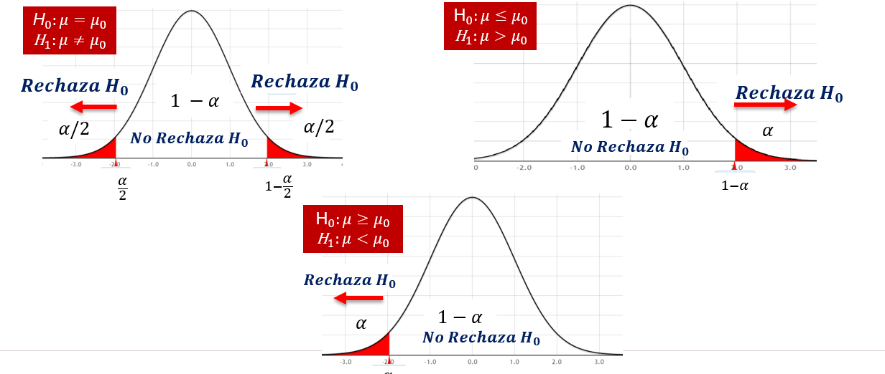
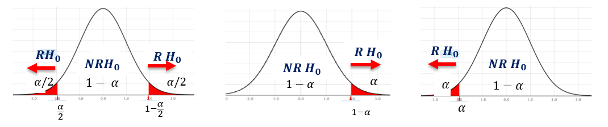

# Grafico General de Hipotesis

# Prueba de Hipotesis para la proporcion

1. **Planteamiento de la Hipotesis**
$$
\begin{array}{cccc}H_0\colon\pi=\pi_0&&H_0\colon\pi\leq\pi_0&&H_0\colon\pi\geq\pi_0\\H_1\colon\pi\neq\pi_0&&H_1\colon\pi>\pi_0&&H_1\colon\pi<\pi_0\end{array}
$$
2. **Fijar el nivel de significancia $\alpha$**
3. **Estadistico de Prueba**
$$
Z_{cal}=\frac{p-{\pi_{hip}}}{\sqrt{\frac{\pi_{hip}(1-{\pi_{hip}})}n}}
$$

4. **Region de rechazo**

5. **Decicion estadistica**
    
    Rechazar $H_0$ si $Z_c$ se encuentra en la región de
    rechazo.

    No Rechazar $H_0$ si $Z_c$ se encuentra en la región de no rechazo.

# Prueba de Hipotesis para la diferencia de proporciones

1. **Planteamiento de la Hipotesis**
$$
\begin{array}{cccc}H_0\colon\pi_1=\pi_2&&H_0\colon\pi_1\leq\pi_2&&H_0\colon\pi_1\geq\pi_2\\H_1\colon\pi_1\neq\pi_2&&H_1\colon\pi_1>\pi_2&&H_1\colon\pi_1<\pi_2\end{array}
$$
2. **Fijar el nivel de significancia $\alpha$**
3. **Estadistico de Prueba**

    Donde la proporcion ponderada $\bar{p}$:
$$
\bar{p}=\frac{X_1+X_2}{n_1+n_2}
$$
$$
Z_{c}=\frac{p_{1}-p_{2}-(\pi_{1}-\pi_{2})_{hip}}{\sqrt{\bar{p}\left(1-\bar{p}\right)\left(\frac{1}{n_{1}}+\frac{1}{n_{2}}\right)}}
$$
4. **Region de rechazo**

5. **Decicion estadistica**
    
    Rechazar $H_0$ si $Z_c$ se encuentra en la región de
    rechazo.

    No Rechazar $H_0$ si $Z_c$ se encuentra en la región de no rechazo.

# Prueba de Hipotesis de la varianza
1. **Planteamiento de la Hipotesis**
$$
\begin{array}{cccc}H_0\colon\sigma_1^2=\sigma_2^2&&H_0\colon\sigma_1^2\leq\sigma_2^2&&H_0\colon\sigma_1^2\geq\sigma_2^2\\H_1\colon\sigma_1^2\neq\sigma_2^2&&H_1\colon\sigma_1^2>\sigma_2^2&&H_1\colon\sigma_1<\sigma_2\end{array}
$$
2. **Fijar el nivel de significancia $\alpha$**
3. **Estadistico de Prueba**
    
    Grado de Libertad $gl$ ó $V$ = $n-1$
$$
X_{Cal}{}^2=\frac{(n-1)S^2}{\sigma^2_{Hip}}
$$

4. **Region de rechazo**

5. **Decicion estadistica**

    * Rechazar $H_0$ si $X^2_{cal}$ se encuentra en la región de
    rechazo.
    * No Rechazar $H_0$ si $X^2_{cal}$ se encuentra en la región de no rechazo.