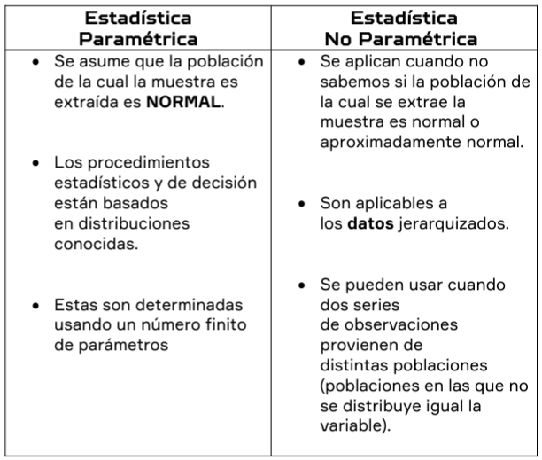
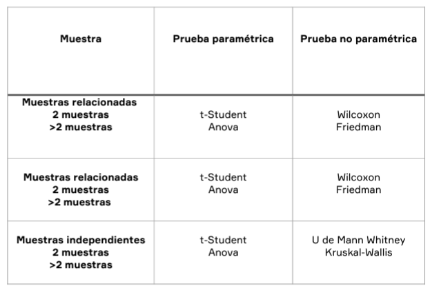

# Inicio

Se inicia con un repaso de la semana 3 y 4, recordando la formulacion de la prueba de hipotesis para los distitos casos.

# Pruebas no Parametricas

Los metodos de prueba de hipotesis anteriores se basaron en muestras aleatorias de poblaciones normales, estas pruebas aun son confiables cuando se experimenta ligeras desviaciones de normalidad, a estos procedimientos de prueba se le llaman **metodos parametricos**.

A continuacion se estudiaran las **pruebas no parametricas** o **metodos de distribucion libre** no se requiere del conocimiento del origen de los datos.

# Estadistica no parametrica

La estadística no paramétrica es una rama de Ia estadística inferencial que estudia las pruebas y modelos estadísticos cuya distribución subyacente no se ajusta a los llamados criterios paramétricos. Su distribución no puede ser definida a priori, pues son los datos observados los que Ia determinan.

## Caracteristicas

- Son más fáciles de usar.
- Son aplicables a datos jerarquizados.
- Se pueden utilizar cuando dos series de observaciones vienen de distintas poblaciones.
- Son una alternativa cuando el tamaño de muestra es pequeño.
- Son útiles a un nivel de significancia previamente especificado.

## Ventajas

- Pueden utilizarse en diferentes situaciones, ya que requieren de un
  mínimo número de supuestos sobre la distribución de la población.
- Generalmente, sus métodos son más sencillos, lo que las hace más
  fáciles de entender.
- Se pueden aplicar en datos no numéricos.
- Facilita Ia obtención de información particular más importante y
  adecuada para el proceso de investigación.

## Desventajas

- No son pruebas sistemáticas.
- La distribución varía, lo que complica seleccionar la elección
  correcta.
- Los formatos de aplicación son diferentes y provoca confusión.
- Es posible que se pierda información porque los datos recolectados
  se convierten en información cualitativa.
- Considera los valores perdidos para obtener información.
- Las hipótesis se basan en rangos, mediana y frecuencia de datos

## Principales pruebas no parametricas

# Lectura:
**¿Qué se entiende por pruebas no paramétricas?**

Las pruebas no paramétricas son métodos estadísticos que no requieren suposiciones sobre la distribución subyacente de los datos en la población de interés. A diferencia de las pruebas paramétricas, que asumen una distribución específica (como la normal), las pruebas no paramétricas son más flexibles y pueden aplicarse a una variedad de situaciones, especialmente cuando los datos no cumplen con los supuestos de los métodos paramétricos.

**¿Consideras importante el uso de la estadística no paramétrica en tu profesión?**

Sí, considero importante el uso de la estadística no paramétrica en mi profesión. En muchos campos, especialmente en áreas como la investigación científica, la medicina, la psicología, el análisis de datos en negocios, y más, es común encontrar datos que no cumplen con los supuestos de normalidad u otras distribuciones paramétricas. En tales casos, las pruebas no paramétricas proporcionan una herramienta valiosa para el análisis estadístico.

**¿Cuáles son las ventajas del uso de los métodos no paramétricos para tu profesión?**

- Flexibilidad para trabajar con una variedad de tipos de datos, incluyendo datos cualitativos, de escala ordinal y de intervalo.

- Facilidad de interpretación y comunicación de resultados.

- Mayor poder de análisis en situaciones donde los supuestos de los métodos paramétricos no se cumplen.

**¿Cómo se define una prueba no paramétrica de signos?**

Una prueba no paramétrica de signos es una prueba estadística que evalúa si la mediana de una población es igual a un valor específico. Se basa en la comparación de las observaciones con un valor de referencia (generalmente la mediana) y determina si hay una diferencia significativa entre ellos.

**¿Cómo se define una prueba no paramétrica de rachas?**

Una prueba no paramétrica de rachas es una prueba estadística que evalúa la aleatoriedad en una secuencia de observaciones. Se basa en identificar rachas o secuencias de observaciones idénticas en la secuencia de datos y determinar si el número observado de rachas es consistente con lo que se esperaría bajo la hipótesis de aleatoriedad.

**Ejemplos de pruebas no paramétricas de signos y rachas en mi profesión:**

1. Prueba no paramétrica de signos

- En un análisis de datos de encuestas de satisfacción del cliente en una empresa, se puede usar una prueba de signos para evaluar si la mediana de la satisfacción del cliente después de la implementación de un nuevo servicio es significativamente mayor que la mediana antes de la implementación.

2. Prueba no paramétrica de rachas

- En un estudio de mercado para evaluar la efectividad de diferentes estrategias publicitarias en la generación de ventas, se puede usar una prueba de rachas para determinar si la secuencia de ventas generadas por cada estrategia publicitaria muestra patrones significativos de aleatoriedad.

# Procedimiento para realizar una prueba de Hipotesis de Signo

## Paso 1

Identificar el tipo de prueba

**Prueba Bilateral**
$$
\begin{aligned}&H_o{:}\textit{Ме}=Me_o\\&H_1{:}\textit{Ме}\neq Me_o\end{aligned}
$$

**Prueba Unilateral Inferior**
$$
\begin{aligned}&H_o\colon\text{Ме}\geq Me_o\\&H_1\colon\text{Ме}<Me_o\end{aligned}
$$

**Prueba Unilateral Superior**
$$
\begin{aligned}&H_o\colon\text{Ме}\leq Me_o\\&H_1\colon\text{Ме}>Me_o\end{aligned}
$$

## Paso 2
Fijar el nivel de significacion $\alpha$ = 1%, 2% etc

## Paso 3
Identificar el estadistico de prueba

## Paso 4
Formular una regla de decisión, establecer la regla de decisión para una prueba Bilateral:
  
Prueba unilateral inferior:
* Si $R+ <n/2$ Entonces --> $P=2P(R\leq r^+$ cuando $p=1/2$ 

Prueba unilateral superior:
* Si $R+ >n/2$ Entonces --> $P=2P(R\geq r^+$ cuando $p=1/2$ 

Es una prueba para evaluar la simetría de una distribución bajo el supuesto que la probabilidad de éxito es igual al 0.5

## Paso 5
No rechazar si $P>\alpha$

# Prueba de rachas
La prueba de rachas permite verificar la hipótesis nula de que la muestra es aleatoria, es decir, si las observaciones seleccionadas secuencialmente, han sido elegidas en forma aleatoria.
El número total de rachas en una muestra proporciona un indicio de si hay o no aleatoriedad en la muestra. Un número reducido de rachas (el caso extremo es 2) es indicio de que las observaciones no se han extraído de forma aleatoria, los elementos de la primera racha proceden de una población con una determinada característica (valores mayores o menores al punto de corte) mientras que los de la segunda proceden de otra población.

# Plantear una prueba de hipotesis de rachas

## Paso 1
Plantear la hipotesis 

$H_0:$ La muestra es aleatoria

$H_1:$ La muestra no es aleatoria

## Paso 2
Se fija el nivel de significacion $\alpha$ = 1%

## Paso 3
Calcular la mediana del conjunto de datos

## Paso 4
Determinar los valores positivos (+) si la observacion es mayor a la mediana y los valores negativos (-) si el valor es menor a la mediana.

## Paso 5
Determinar n1 para cada racha de valores negativos y n2 para cada racha de valores positivos.

## Paso 6
Determinar la aproximación a la Distribución Normal, mediante las siguientes fórmulas.

$$
z=\frac{G-\mu_{G}}{\sigma_{G}}
$$

Donde:

$$
z=\frac{2n_{1}\eta_{2}}{n_{1}+\eta_{2}}+1
$$

$$
\sigma_G=\sqrt{\frac{(2\eta_1\eta_2)(2\eta_1\eta_2-\eta_1-\eta_2)}{(\eta_1+\eta_2)^2(\eta_1+\eta_2-1)}}
$$

## Paso 7
Si $Z\alpha/2$ < $Z$ < $Z1-\alpha/2$

Se acepta la $H_0$

