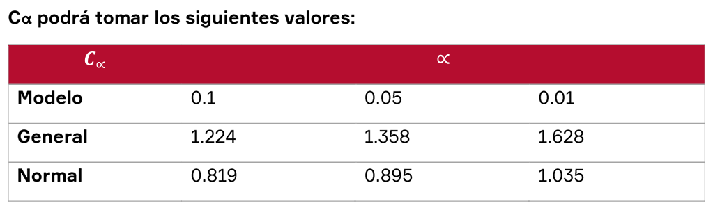
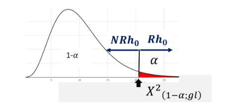

# Prueba de rangos wilcoxon

La prueba de los rangos con signo de Wilcoxon es una prueba no paramétrica que sirve para **comparar el rango medio de dos muestras relacionadas** y determinar si existen diferencias entre ellas. Se utiliza como **alternativa a la prueba t de Student** cuando no se puede suponer la normalidad de dichas muestras.
Es una prueba no paramétrica de comparación de dos muestras relacionadas y por lo tanto **no necesita una distribución especifica.** Usa más bien el nivel ordinal de la variable dependiente. Se utiliza para comparar dos mediciones relacionadas y determinar si la diferencia entre ellas se debe al azar o no (en este último caso, que la diferencia sea estadísticamente significativa).

# Prueba de Hipotesis

Suponinedo que las distribuiones son continuas y simetricas se puede plantear los siguiente:

$H_0 : u2 = ul$ (No hay diferencia de medias)

$H_1 : u2 < ul$ (Hay diferencia de medias)

Se rechaza $H_0$ si $Z<Z_a$

**FORMULAS:**

Para muestras grandes $n>30$

$$
T = \text{Min} (T+,T-)
$$

$$
E(t)=\frac{n(n+1)}{4}
$$

$$
\sigma(t)=\frac{n(n+1)(2n+1)}{24}
$$

$$
Z=\frac{T_{min}-E(t)}{\sqrt{\sigma(t)}}
$$

# Prueba U de Mann Whitney

Es **otra version** no parametrica **de** la prueba **t de student**, Usada para comprobar la Heterogeneidad de dos muestras ordinales.
Planteamiento de partida:

- Las observaciones de ambos grupos son
  independientes.
- Las observaciones son variables ordinales o continuas.
  Bajo la hipótesis nula, la distribución de partida de
  ambos grupos es la misma: P(X > Y) = P(Y > X).
- Bajo la hipótesis alternativa, los valores de una de las
  muestras tienden a exceder a los de la otra:

## Calculo del estadistico

Para calcular el estadístico U se asigna a cada uno de los valores de las dos muestras su rango para construir.

$$
U_1=\eta_1\eta_2+\frac{\eta_1\left(\eta_1+1\right)}{2}-R_1
$$

$$
U_2=\eta_1\eta_2+\frac{\eta_2\left(\eta_2+1\right)}{2}-R_2
$$

Donde n1 y n2 son los tamaños respectivos de cada muestra; R1 y R2 es la suma de los rangos (la suma de la posición relativa de cada individuo de la muestra) de las observaciones de las muestras 1 y 2 respectivamente.

**Se debe tener en cuenta la presencia de observaciones identicas**, si su numero es pequeño se puede ignorar estas circunstancias.

Aproximacion normal **Z cuando tenemos muestras $n$** lo suficientemente grandes

$$
z=\quad\frac{\mathrm{U-U_{u}}}{\mathrm{\sigma u}}
$$

Donde $\mu$ y $\sigma_U$ son la media y la desviación estándar de U si la hipótesis nula
es cierta y vienen dadas por las siguientes formulas:

$$
\mu_{u}=\frac{\text{n}1^{*}\text{n}2}2
$$

$$
\sigma_U=\sqrt{\frac{\eta_1\eta_2(\eta_1+\eta_2+1}{12}}
$$

# Prueba de Kruskal Wallis

Es un método no paramétrico para probar si varias muestras independientes (más de 2 muestras o lo que es lo mismo decir "K" Muestras independientes) provienen de misma población.
Es una prueba no paramétrica de comparación de 3 o más grupos independientes, debe cumplir las siguientes características:

- No necesita una distribución especifica
- Nivel ordinal de la variable dependiente

Se utiliza para **comparar** más de 2 grupos de **rangos(medianas)** y **determinar que las diferencia no se deba al azar** (que la diferencia sea estadísticamente significativa).

**Estadistico de pruebas:**

$$
\text{H}=\frac{12}{\eta(n+1)}\sum\frac{R_i^2}{n_i}\}-3(\eta+1)
$$

## Procedimiento para calcular la prueba de Kruskal Wallis

1. **Planteamiento de la Hipotesis**
   - H0: Las muestras provienen de poblaciones idénticas
   - H1: Las muestras provienen de poblaciones diferentes
2. **Se ordenan las "n" observaciones de menor a mayor y se asignan rangos de 1 a n**
3. **Se obtiene la suma de los rangos de cada muestra correspondientes a las muestras, Rj y se halla el rango promedio.**
4. **Calcular el estadístico de prueba.**
5. **Buscar el valor del estadístico H en la Tabla de Chi Cuadrado con k-1 grados de libertad, k = numero de grupos.**
6. **Conclusiones**

# Prueba de Friedman

Es una prueba no paramétrica para varias muestres relacionadas. El método consiste en ordenar los datos por filas o bloques, reemplazándolos por su respectivo orden. Al ordenarlos debemos considerar la existencia de datos idénticos. Es una variante de la prueba de Kruskal Wallis.

**Estadistico de pruebas:**

$$
\mathrm{X}_i^2=\frac{12}{\mathrm{HK}(\mathrm{K}+1)}\sum Rc^2-3\mathrm{H}(K+1)
$$

**Donde:**

- $X^2_r$ = Estadístico calculado del análisis de varianza por rangos por Friedman.
- $H$ = Representa el número de elementos o bloques (Numero de hileras).
- $K$ = El número de variables relacionadas.

# Pruebas de normalidad

Se aplica para comprobar si la distribución de datos de una muestra se ajusta a una Distribución Normal Teórica. Existen diversas pruebas para comprobar si una distribución de datos se ajusta a una distribución normal. Para nuestro análisis aplicaremos la Prueba de Kolmogorov Smirnov:

## Prueba de Kolmogorov Smirnov:

Prueba de Kolmogorov Smirnov (KS): Es una prueba no paramétrica que determina **la bondad de ajuste de un conjunto de datos con una distribución específica**. Se deben realizar los siguientes pasos:

1. **Planteamiento de la Hipotesis**

- H0: Los datos analizados siguen una distribución normal estándar
- H1: Los datos analizados no siguen una distribución normal estándar

2. $\alpha$ = 0.1, 0.05, 0.01
3. **Estadistico de Prueba:**
   $$
   \begin{aligned}D&=\text{su p}\mid\widehat{F_n}(X_i)-F_0(X_i)\\1&\le i\le n\end{aligned}
   $$
   Donde:

- $X_i$: es el i-esimo valor observado en la muestra (cuyos valores se han ordenado previamente de mayor a menor).
- $F_n(Xi)$: es un estimador de la. probabilidad de observar valores menores o iguales que Xi

- $F_o(Xi)$: es la probabilidad de observar valores menores o iguales que Xi cuando H0 es cierta.

  **Para efectos prácticos**

  $$
  D^+=\max\left\{\frac{i}{n}-F_0(X_i)\right\}\quad D^-=\max\left\{F_0(X_i)-\frac{i-1}{n}\right\}
  $$

  Por tanto, a partir de estos Valores $D=\max\{D^{+},D^{-}\}$

4. Por tanto, el criterio para rechazar o aceptar la prueba de hipótesis es:

   - Si $D_\alpha\geq{D_{max}}$ (Aceptar Ho)
   - Si $D_\alpha\leq{D_{max}}$ (Rechazar Ho)

     **Donde:**

     $$
     D_{\alpha}=\frac{C_{\alpha}}{k(n)}
     $$

     

     K puede tomar los siguietnes valores:

     $$
     k(n)=\sqrt{n}-0.01+\frac{0.85}{\sqrt{n}}
     $$

## Prueba de Shapiro Wilk

El Test de Shapiro—Wilk se usa para contrastar la normalidad de un conjunto de datos y plantea como hipótesis nula que una muestra x1,x2, xn, proviene de una población normalmente distribuida. Fue publicado en 1965 por Samuel Shapiro y Martin Wilk. Se considera uno de los test más potentes para el contraste de normalidad.

1.  - Ho: Los datos de la muestra siguen una distribución normal estándar
    - H1: Los datos de la muestra no siguen una distribución normal estándar

2.  $\alpha$= 0.1, 0.05, 0.01
3.  El estadístico del test es:

    $$
    W=\frac{(\sum_{i=1}^n\alpha_ix(i))^2}{\sum_{i=1}^n(x_i-\overline{x})^2}
    $$

    **Donde:**

    - Xi es el número que ocupa la vigésima posición en la muestra (con la muestra ordenada de mayor a menor)
    - $x$ es la media muestral
    - Las variables (a1, a2...an) se calculan de la siguiente manera:

      $$
      (a_1,\ldots,a_n)=\frac{m^TV^{-1}}{(m^TV^{-1}V^{-1}m)^{1/2}}
      $$

      Siendo (m1, m2, ....., mn) los valores medios del estadístico ordenado de variables aleatorias independientes e idénticamente distribuidas, muestreadas de distribuciones normales.

      V denota la matriz de covarianzas de este estadístico de orden.

4.  En esta prueba se rechazará si el estadístico W es menor a $W\alpha$ o si el estadístico p-valúe es menor a $\alpha$(nivel de significación).
5.  Conclusiones

# Prueba Chi-Cuadrado

- **Una Variable:** Prueba bondad de ajuste
- **Dos Variables:** Prueba de Independencia ->Prubeba de Homogeneidad (Proporciones)

**Usos**

- Para hacer inferencias acerca de la varianza poblacional. Es decir, para calcular Intervalos de Confianza y Prueba de Hipótesis para la varianza poblacional.
- Para hacer pruebas de Bondad de Ajuste. O sea, para probar si un conjunto de datos sigue una distribución predeterminada.
- Para hacer análisis de tablas de contingencia.

Nivel de significancia = $\alpha$

grados de libertad = $n-1$

$$
Xi(\alpha,(n-1))
$$

# Prueba de Bondad de ajuste

En diversas situaciones se requiere conocer si la data muestral proviene o no de una determinada distribución probabilística. ¿Cómo proceder?

La prueba de bondad de ajuste Chi-cuadrado es una prueba estadística que permite determinar si una data muestral proviene o no de una hipotética distribución.

¿Los datos de la muestra son coherentes con una distribución supuesta?

## Prueba de Independencia

1. **Plantear Hipotesis**

- Ho: Los datos se ajustan a una distribución específica (Uniforme, Poisson, Binomial, Normal)
- H1: Los datos NO se ajustan a una distribución específica (Uniforme, Poisson, Binomial, Normal)

2. **Establecer el nivel de significación:**

   $\alpha$=1%,5%,10%,etc...

3. **Estadistico de prueba**

   $$
   {X_C}^2=\frac{\sum{(O_i-E_i)^2}}{E_i}
   $$

   **Donde:**

- O: frecuencia observada Generalmente dato del problema
- E: frecuencia esperada -> Se tiene que estimar y depende del tipo de la distribución

  La frecuencia esperada depende de la distribución que se quiere probar:

- Distribucion de Poisson
  $$
  f(X,\lambda)=\frac{e^{-\lambda}\lambda^X}{X!}
  $$
- Distribucion Binomial
  $$
  P(x)=\binom nxp^Xq^{n-X}
  $$

4.  **Region Critica**

    

    $gl = k-m-1$

    Donde: $K$ = Número de categorias o clases | $m$ = Número de parametros estimados
5. **Descicion estadistica y conclusiones**

