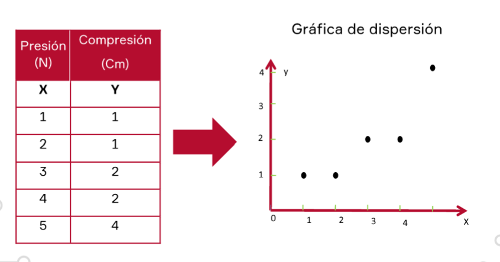
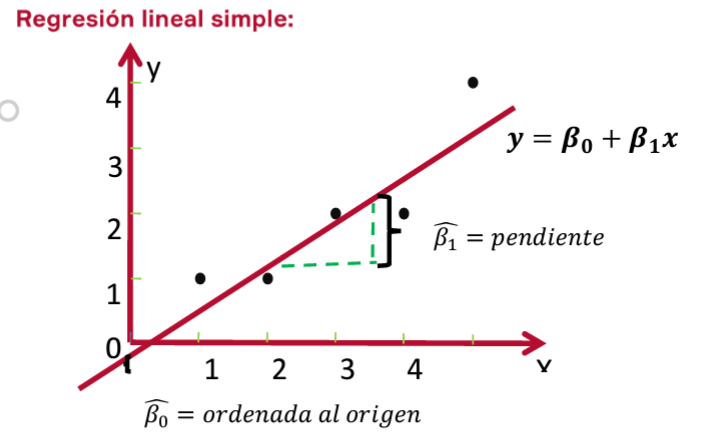
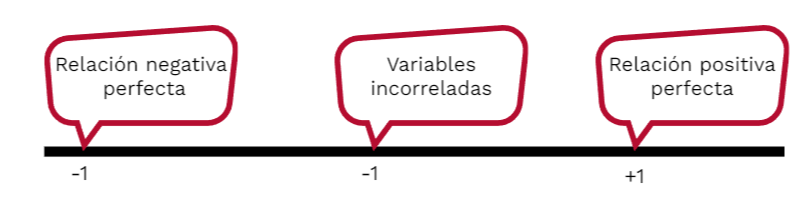
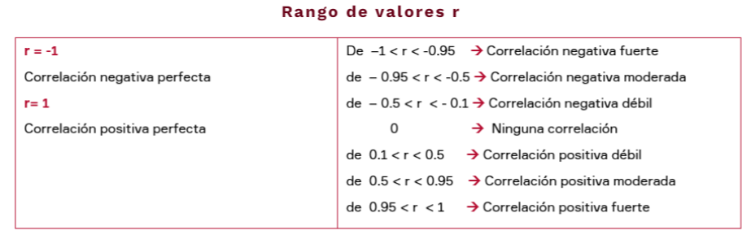

# Regresion Lineal

Regresion Lineal Simple
Frecuentemente resulta de interés conocer el efecto que una o varias
variables pueden causar sobre otra; es decir, en la vida real y científica nos encontramos con modelos en los que el comportamiento de una variable Y se puede explicar a través de una variable X. La regresión lineal es un modelo estadístico usado para aproximar la relación de una variable dependiente, llamada Y, y una o más variables independientes, llamadas Xi y un término aleatorio muchas veces llamado error $\epsilon$ 

**Representacion:**
$$
Y=f(x)+\varepsilon 
$$

Por lo tanto, el análisis de regresión involucra el estudio de la relación entre variables.

**Regresión lineal simple: Ejemplo demostrativo**

La solución es construir un modelo probabilístico que relacione "y" con "x"; uno que contemple la variación aleatoria de los puntos de datos a los lados de una línea recta.

El **modelo de regresión lineal simple** supone que el valor medio de Y para un valor dado de X se grafica como una línea recta y que los puntos se desvían de esta línea de medias en una cantidad aleatoria (positiva o negativa) igual a $\epsilon$, es decir:

$$
y=\beta_0+\beta_1x+\varepsilon 
$$
**Donde:**
$\beta_0+\beta_1x$ (Coeficientes Desconocidos del modelo) : Valor medio de **Y** para una **X** dada | $\epsilon$ : Error aleatorio

**Condición:** $E(\epsilon) = 0$ 

### Interpretacion de Coeficientes

$$
\hat{y}=\hat{\beta}_{0}+\hat{\beta}_{1}X
$$

**Donde:** 

$\hat{\beta}_{0}+\hat{\beta}_{1}X$: Es el cambio (aumento o disminución) en promedio en Y cuando X varía en una unidad.

* Si b>0 , esto nos indica que, al aumentar el valor de X(variable independiente), también aumenta el valor de Y (variable dependiente) (promedio).
* Si b<0 , esto nos indica que, al aumentar el valor de X(variable independiente), el valor de Y (variable dependiente) disminuye (promedio).

### Supuestos Regresion Lineal
Existe linealidad si se presenta una relación significativa entre la variable que se quiere predecir y las otras variables. Puede **usarse el coeficiente "R cuadrado ajustado" para saber si existe linealidad ($R\geq0.7$ mayor o igual a 0.7 suele ser "indicio" de linealidad).** El **ANOVA** es una prueba para saber la linealidad.

* Los residuos tienen media 0.
* La varianza de los residuos no depende de $Xi$ **(homocedasticidad)**
* Los residuos son normales.
* Los residuos son aleatorios.

Para **estimar la recta de regresión** utilizaremos el **método de mínimos cuadrados**. Este método consiste en minimizar la suma de los cuadrados de los errores:

## Cálculo de coeficientes práctico

Paso 1.
$$
\widehat{\beta}_{1}=\frac{n\sum XY-\sum X\sum Y}{n\sum X^{2}-(\sum X)^{2}}
$$

Paso 2.
$$
\widehat{\beta}_{0}=\frac{\sum Y-\widehat{\beta}_{1}\sum X}n
$$

## Intervalo de Confianza
Una vez que se ha determinado la validez del modelo de regresión lineal simple, la ecuación de pronóstico estará dada por:

$$
\hat{y}=\hat{\beta}_{0}+\hat{\beta}_{1}X
$$

El valor de $\hat{y}$ puede interpretarse de dos maneras:

* Como la predicción de un valor individual predicho de Y para un valor dado de X, en el cual se utilizar un intervalo de predicción.
* Como el valor medio estimado de Y para un valor dado de X. en el cual se utiliza el intervalo de confianza.

**Diferencia entre predicción de un valor individual y valor medio estimado**

Tanto la predicción como la estimación del valor medio pueden tomar la forma de un intervalo, y al igual que en el caso puntual, el intervalo puede tomar dos formas:
1. Un **intervalo de predicción** para el valor individual de Y dado un valor de X
2. Un **intervalo de confianza** para el valor medio de Y dado un valor X

- El intervalo de predicción de $100 (1-\alpha)\%$ para un valor de Y dado X está dado por:
$$
IP\left(\frac YX=x_0\right)=\widehat Y\pm t_{\left(1-\frac\alpha2,n-2\right)}*\sqrt{CME\left(1+\frac1n+\frac{(x_0-\overline X)^2}{SC(X)}\right)}
$$
- El intervalo de confianza de $100 (1-\alpha)\%$ para un valor de Y dado X está dado por:
$$
IC\left(\frac YX=x_0\right)=\widehat Y\pm t_{\left(1-\frac\alpha2,n-2\right)}*\sqrt{CME\left(\frac1n+\frac{(x_0-\overline X)^2}{SC(X)}\right)}
$$

# Coeficiente de Correlacion ($r$)

El coeficiente de correlación de Pearson(r), pensado para variables cuantitativas, es un índice que mide el grado de covariación entre distintas variables relacionadas linealmente. Esto significa que puede haber variables fuertemente relacionadas, pero no de forma lineal.

$$
r=\frac{n\sum XY-\sum X\sum Y}{\sqrt{\boldsymbol{n}\sum X^{2}-\left(\sum X\right)^{2}.\sqrt{\boldsymbol{n}\sum Y^{2}-\left(\sum Y\right)^{2}}}}
$$

Se puede calcular el **coeficiente de Determinacion** de manera sencilla. *(Solo aplica para Regresion Lineal Simple)*
$$
C.Determinacion = r^2
$$

