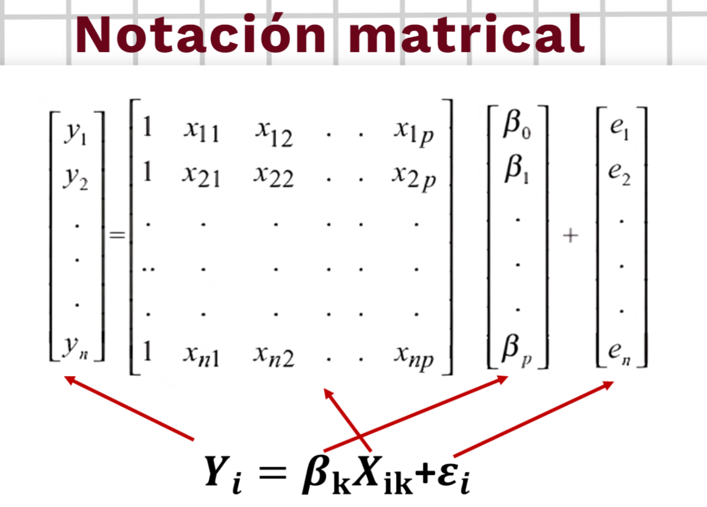

# Coeficiente de Determinacion ($r^2$)

El coeficiente de determinación es la proporción o porcentaje de variación total en Y respecto a su media, que es explicada por el modelo de regresión. Es usual expresar esta medida en tanto por ciento, multiplicándola por cien.

$$
0\leq{R^2}\leq1
$$

Descomposicion de la Variabilidad de Y:

$$
SCT = SCR + SCE\\{}\\R^{2}=\frac{\sum(\hat{Y}-\bar{Y})^{2}}{\sum(Y-\bar{Y})^{2}}=\frac{SCR}{SCT}
$$

EI resultado del $r^2$ osciIa entre 0 y 1. Cuanto **más cerca de 1** se sitúe su valor, **mayor será el ajuste** del modelo a la variable que estamos intentando explicar. De forma inversa, cuanto más **cerca de cero**, **menos ajustado** estará el modelo y, por tanto, menos fiable será.

**Ejemplo:**

$$
\hat{Y}=2.56665+2.7565X\\{}\\R^{2}=0.8998\hspace{0.5cm}r=0.9485
$$

**Interpretacion:**

- El ajuste del modelo es bueno, ya que el valor de 0.8998 es cercano a 1, en concreto, el 89,98% de la variabilidad de la variable de Y es explicado por el modelo de regresión ajustado. Podemos concluir que el modelo lineal es adecuado para describir la relación que existe entre estas variables (X e Y).
- El coeficiente de correlación de r = 0.9485, indica que existe una relación lineal intensa entre X e Y de manera directa

**En una regresión lineal simple el coeficiente de determinación coincide con la correlación de Pearson o coeficiente de correlación elevada al cuadrado.**
$$R^2=r^2$$

# Regresion Lineal Simple - (Analisis de Varianza y Correlacion):

Consiste en descomponer la variabilidad de la variable dependiente (Y) en variabilidad explicada por el modelo **(Regresión)** más variabilidad no explicada **(error)**. Bajo la hipótesis de que existe una relación lineal entre la variable respuesta y Ia regresora, se quiere realizar el siguiente contraste de hipótesis.
$$y=\beta_{0}+\beta_{1}x$$

## Pasos

**Paso 1.** Planteo de Hipótesis:

$H_0:\beta_1 = 0$ _(No hay relación lineal entre X e Y)_---(El modelo **no** es significativo)
$H_0:\beta_1 \neq 0$ _(Si hay relación lineal entre X e Y)_---(El modelo **si** es significativo)

**Paso 2.** Cálculo del Estadístico de Contraste (construir cuadro Anova)
$$\mathbf{F}=\frac{SCR/1}{SCE/(n-2)}=\frac{CMR}{CME}$$

**Paso 3.** Grafica de la Región Critica | Determinacion del Punto Critico $\large{F}_{(1-\alpha,k,n-k-1)}$

**Paso 4.** Decisión

Si $F_{calculado}>F_{critico}$ , rechazamos $H_0$, por tanto sí existe regresión lineal entre con al menos $x_1, x_2$ e $Y$

# Residuos

En un modelo de regresión, los residuos o errores son las diferencias entre los verdaderos valores que toma la variable dependiente y los valores estimados. Se calculan por tanto mediante:
$$\large\widehat{\varepsilon}_{i}=y_{i}-\widehat{y}_{i}$$

- Suma de Cruadrados **Total** _(SCT)_
  $$\sum_{i=1}^n(y_i-\bar{y})^2\hspace{0.5cm}gl = n-1$$
- Suma de Cruadrados **Regresión** _(SCR)_
  $$\sum_{i=1}^n(\hat{y}_i-\bar{y})^2\hspace{0.5cm}gl=1$$
- Suma de Cruadrados **Error** _(SCE)_
  $$\sum_{i=1}^n(y_i-\hat{y_i})^2\hspace{0.5cm}gl=n-2$$

**Donde:**

- $\bar{y}:$ Promedio de Y
- $y_i: $ i-esimo valor de $Y$
- $\hat{y_i}: $ i-esimo valor de $\hat{Y}$

## Pasos

**Paso 1.** Planteo de Hipótesis:

$H_0:\beta_1 = 0$ (No hay relación lineal entre X e Y)

$H_0:\beta_1 \neq 0$ (Si hay relación lineal entre X e Y)

**Paso 2.** Cuadro Anova

**Estadistico de Prueba**
$$\large{F_C}=\frac{CM_R}{CM_E}\sim F_{(probabilidad,1,n-2)}$$

**Paso 3.** Grafica de la Región Critica

# Informacion Adicional

Software Estadístico y el P-value

Un valor p oscila entre 0 y 1. El valor p es una probabilidad que mide la evidencia en contra de Ia hipótesis nula. Las probabilidades más bajas proporcionan una evidencia más fuerte en contra de la hipótesis nula.

**Decisión Estadística**

- Si $P_{value}\leq\alpha$ Decisión: Rechazar Hipótesis nula
- Si $P_{value}>\alpha$ Decisión: No Rechazar Hipótesis nula

$\alpha $= es **fijado** y generalmente es 0.05

**ESTIMACIÓN DE VARIANZA**

Para estimar la varianza de los errores, $\sigma^2$, podemos utilizar:
$$\widehat{\sigma}^2=\frac{\sum_{i=1}^ne_i^2}n$$
que es el estimador máximo verosímil de $\sigma^2$, pero es un estimador sesgado.

Un estimador insesgado de $\sigma^2$ es la varianza residual:
$$S_{R}^{2}=\frac{\sum_{i=1}^{n}e_{i}^{2}}{n-2}$$

# Regresion Lienal multiple

El objetivo básico del **Análisis de Regresión Lineal Múltiple** es el de construir un modelo que **permita predecir o estimar el valor de una variable Y**, en base a un conjunto de variables $X_1,X_2...,X_k$

A la variable Y se le llama variable dependiente, y es la que se quiere estimar o
predecir. Las variables $X_1,X_2...,X_k$ son las variables independientes o variables predictoras.
$$Y_i=\beta_0+\beta_1X_1+\beta_2X_2+\varepsilon_i$$

Supuestos:

- Los residuos tienen media 0.
- La varianza de los residuos no depende de xi (homocedasticidad).
- Los residuos son normales.
- Los residuos son aleatorios.
- Las variables XI, x2, etc. no están linealmente correlacionadas entre sí.

El modelo poblacional de regresión lineal múltiple,con k variables independientes, es el siguiente:
$$Y_i=\beta_0+\beta_1X_1+\beta_2X_2+\varepsilon_i$$

**Donde:**

Son parámetros desconocidos, llamados coeficientes de regresión. (i = 0,1,2,3,...,k) Son los errores del modelo, y se suponen independientes y normalmente distribuidos con media 0 y varianza $\sigma^2$
$$\begin{aligned}\widehat{Y}=\beta_0+\beta_1X_1+\beta_2X_2+...+\beta_\text{k}X_\text{k}\end{aligned}$$
Estos coeficientes son calculados a partir del método de los mínimos cuadrados.

## Resolución de Regresión Lineal Múltiple: notación matricial

Para determinar la ecuación de regresión lineal múltiple muestral, debemos primero identificar la variable dependiente y luego las variables independientes. Una vez identificados, formaremos nuestro sistema de matrices para cada uno de ellos, formando el siguiente sistema de ecuación de regresión múltiple, y ubicándolos de esta forma:
$$Y_i=\beta_{k}X_{ik}+e_i$$
Quedando el sistema de matrices definida de la siguiente manera:

**Donde:**

- $Y_i$: es la matriz de la variable dependiente
- $X_i$: es la matriz de la variable independiente
- $B_i$: es la matriz de los coeficientes predictores
- $e_i$: es la matriz del error de estimación

**Nota:** En la primera columna de la matrizde la variable independiente se pone 1, que corresponde al valor de la constante.

Para hallar el valor de cada uno de los coeficientes regresores p, resolveremos las
siguientes operaciones matriciales:
$$\beta=(X^{T}X)^{-1}X^{T}Y$$
Donde:

- $X^T$: Es la matriz transpuesta de la variable independiente
- $(X^T X)^{-1}$ :es la matriz inversa
- $\beta$ : es Ia matriz de los coeficientes regresores
  $$\beta=(X^TX)^{-1}X^TY\rightarrow\beta=\begin{bmatrix}\beta_0\\\beta_1\\.\\.\\\beta_k\end{bmatrix}$$

Coeficiente de regresión en el caso de dos variables independientes:
**Matrices**

$$
A=X^TX=\begin{bmatrix}n&\sum_{i=1}^nX_{1i}&\sum_{i=1}^nX_{2i}\\\sum_{i=1}^nX_{1i}&\sum_{i=1}^nX_{1i}^2&\sum_{i=1}^nX_{1i}X_{2i}\\\sum_{i=1}^nX_{2i}&\sum_{i=1}^nX_{1i}X_{2i}&\sum_{i=1}^nX_{2i}^2\end{bmatrix}
$$

$$
G=X^TY=\begin{bmatrix}\sum_{i=1}^nY_i\\\\\sum_{i=1}^nX_{1i}Y_i\\\\\sum_{i=1}^nX_{2i}Y_i\end{bmatrix}
$$

$$\beta=A^{-1}\boldsymbol{G}=\begin{bmatrix}\beta_0\\\beta_1\\\beta_2\end{bmatrix}$$

Coeficiente de regresión en el caso de dos variables independientes: Sistema de ecuaciones

$$\sum Y=n\beta_0+\beta_1\sum X_1+\beta_2\sum X_2$$
$$\sum Y=n\beta_0+\beta_1\sum X_1+\beta_2\sum X_2$$
$$\sum X_2Y=\beta_0\sum X_2+\beta_1\sum X_1X_2+\beta_2\sum{X_2}^2$$

# Matriz Varianza Covarianza

Una matriz de varianzas-covarianzas es una matriz
cuadrada que contiene las varianzas y covarianzas
asociadas con diferentes variables.
Los elementos de la diagonal de la matriz contienen las
varianzas de las variables, mientras que los elementos
que se encuentran fuera de Ia diagonal contienen las
covarianzas entre todos los pares posibles de variables.
La matriz de varianzas — covarianzas viene definida de
la siguiente manera:

$$
VC=\begin{bmatrix}\sigma_y^2&S_{yX_1}&...&S_{yX_m}\\S_{X_1y}&\sigma_{X_1}^2&...&\vdots\\\vdots&\vdots&\ddots&\vdots\\S_{X_ny}&...&...&\sigma_{X_m}^2\end{bmatrix}
$$

Donde:

- $\large\sigma^2_y$: representa la varianza de la variable y respecto a su media
- $\large{S_{yX_n}}$: representa la covarianza de la variable y respecto a la variable $X_n$

Para obtener los valores de la matriz de varianza covarianza se realizan los siguientes cálculos:
$$\sigma_y^2=\frac{\sum_{i=1}^NY_i}N-\bar{Y}^2$$
$$S_{YX_1}=\frac{\sum_{i=1}^NY_iX_{1i}}{N}-\bar{Y}\bar{X}_{1i}$$

Se realiza de la misma manera para cada variable que se tenga del modelo de regresión múltiple.

# Intervalo de Confianza

Como en la regresión lineal simple, en la regresión múltiple es posible interpretar el valor $\hat{y}$ de dos formas:
* $\hat{y}$ puede interpretarse como la **estimación de la media** de la subpoblación de los valores de Y que se supone existen para combinaciones particulares de valores X.
* $\hat{y}$ es el **valor que más probablemente asumirá Y** para los valores dados de las Xi.

# Intervalo de confianza para la respuesta media:

De acuerdo con esta interpretación, $\hat{y}$ es una estimación, y cuando se utiliza para este propósito, a la ecuación se le llama **ecuación de estimación.**

Cuando $\hat{y}$ se interpreta como una estimación de la
media de la población, al intervalo se le llama **intervalo
de confianza.**
$$IC\left(\mu_{\gamma|X_{0}}\right)=\widehat{\gamma}_{0}\pm t_{\left(1-\frac{a}{2}\right)}\sqrt{CME\left[x'_{0}(X'X)^{-1}x_{0}\right]}$$

Donde:
* La distribución t con $n-k-1$ grados de libertad (k: número de variables independientes). 
* $x_o$ es el vector que contiene los valores de las
variables independientes para los cuales se desea
hacer el pronóstico.
* CME es:
$$S=\sqrt{\frac{\sum(y-\widehat{y})^2}{n-k-1}}=\frac{\sqrt{y'y-\beta'X'y}}{n-k-1}=\sqrt{CME}$$

# Intervalo de predicción para $Y_0$

En este caso, $\hat{y}$ es el valor pronosticado o valor de predicción de Y, y a la ecuación se le llama ecuación de predicción.

Cuando $\hat{y}$ se interpreta como un valor de predicción de Y, al intervalo se le llama intervalo de predicción.
$$IP(y)=\hat{\gamma}_{0}\pm t_{\left(1-\frac{\alpha}{2}\right)}\sqrt{CME[1+{x'}_{0}(X'X)^{-1}x_{0}]}$$
Donde:
La distribución t con $n-k-1$ grados de libertad y CME es:
$$S=\sqrt{\frac{\sum(y-\hat{y})^2}{n-k-1}}=\frac{\sqrt{y'y-\beta'X'y}}{n-k-1}=\sqrt{CME}$$

