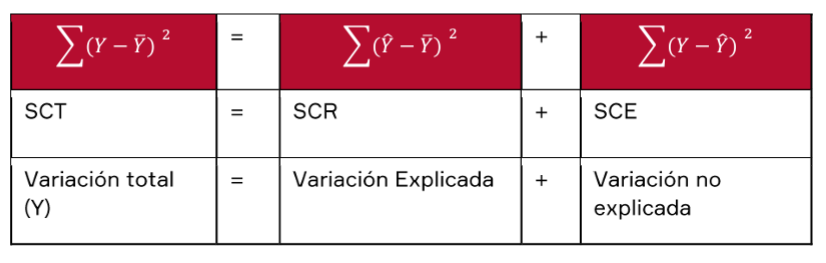
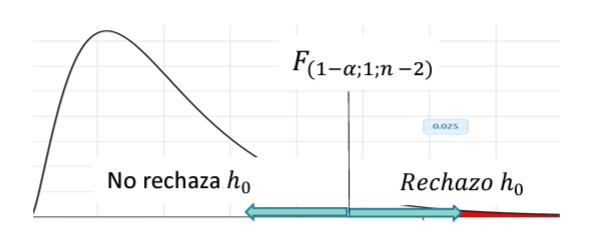
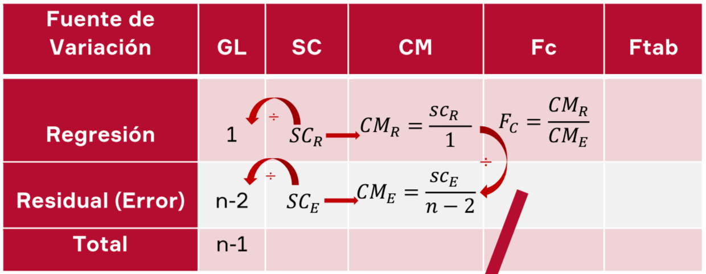

# Coeficiente de Determinacion ($r^2$)

El coeficiente de determinación es la proporción o porcentaje de variación total en Y respecto a su media, que es explicada por el modelo de regresión. Es usual expresar esta medida en tanto por ciento, multiplicándola por cien.

$$
0\leq{R^2}\leq1
$$

Descomposicion de la Variabilidad de Y:

$$
SCT = SCR + SCE\\{}\\R^{2}=\frac{\sum(\hat{Y}-\bar{Y})^{2}}{\sum(Y-\bar{Y})^{2}}=\frac{SCR}{SCT}
$$

EI resultado del $r^2$ osciIa entre 0 y 1. Cuanto **más cerca de 1** se sitúe su valor, **mayor será el ajuste** del modelo a la variable que estamos intentando explicar. De forma inversa, cuanto más **cerca de cero**, **menos ajustado** estará el modelo y, por tanto, menos fiable será.

**Ejemplo:**

$$
\hat{Y}=2.56665+2.7565X\\{}\\R^{2}=0.8998\hspace{0.5cm}r=0.9485
$$

**Interpretacion:**

- El ajuste del modelo es bueno, ya que el valor de 0.8998 es cercano a 1, en concreto, el 89,98% de la variabilidad de la variable de Y es explicado por el modelo de regresión ajustado. Podemos concluir que el modelo lineal es adecuado para describir la relación que existe entre estas variables (X e Y).
- El coeficiente de correlación de r = 0.9485, indica que existe una relación lineal intensa entre X e Y de manera directa

**En una regresión lineal simple el coeficiente de determinación coincide con la correlación de Pearson o coeficiente de correlación elevada al cuadrado.**
$$R^2=r^2$$

# Regresion Lineal Simple - (Analisis de Varianza y Correlacion):

Consiste en descomponer la variabilidad de la variable dependiente (Y) en variabilidad explicada por el modelo **(Regresión)** más variabilidad no explicada **(error)**. Bajo la hipótesis de que existe una relación lineal entre la variable respuesta y Ia regresora, se quiere realizar el siguiente contraste de hipótesis.
$$y=\beta_{0}+\beta_{1}x$$

## Pasos

**Paso 1.** Planteo de Hipótesis:

$H_0:\beta_1 = 0$ _(No hay relación lineal entre X e Y)_---(El modelo **no** es significativo)
$H_0:\beta_1 \neq 0$ _(Si hay relación lineal entre X e Y)_---(El modelo **si** es significativo)

**Paso 2.** Cálculo del Estadístico de Contraste (construir cuadro Anova)
$$\mathbf{F}=\frac{SCR/1}{SCE/(n-2)}=\frac{CMR}{CME}$$

**Paso 3.** Grafica de la Región Critica | Determinacion del Punto Critico $\large{F}_{(1-\alpha,k,n-k-1)}$

**Paso 4.** Decisión

Si $F_{calculado}>F_{critico}$ , rechazamos $H_0$, por tanto sí existe regresión lineal entre con al menos $x_1, x_2$ e $Y$

# Residuos

En un modelo de regresión, los residuos o errores son las diferencias entre los verdaderos valores que toma la variable dependiente y los valores estimados. Se calculan por tanto mediante:
$$\large\widehat{\varepsilon}_{i}=y_{i}-\widehat{y}_{i}$$

- Suma de Cruadrados **Total** _(SCT)_
  $$\sum_{i=1}^n(y_i-\bar{y})^2\hspace{0.5cm}gl = n-1$$
- Suma de Cruadrados **Regresión** _(SCR)_
  $$\sum_{i=1}^n(\hat{y}_i-\bar{y})^2\hspace{0.5cm}gl=1$$
- Suma de Cruadrados **Error** _(SCE)_
  $$\sum_{i=1}^n(y_i-\hat{y_i})^2\hspace{0.5cm}gl=n-2$$

**Donde:**

- $\bar{y}:$ Promedio de Y
- $y_i: $ i-esimo valor de $Y$
- $\hat{y_i}: $ i-esimo valor de $\hat{Y}$

## Pasos

**Paso 1.** Planteo de Hipótesis:

$H_0:\beta_1 = 0$ (No hay relación lineal entre X e Y)

$H_0:\beta_1 \neq 0$ (Si hay relación lineal entre X e Y)

**Paso 2.** Cuadro Anova

**Estadistico de Prueba**
$$\large{F_C}=\frac{CM_R}{CM_E}\sim F_{(probabilidad,1,n-2)}$$

**Paso 3.** Grafica de la Región Critica 

# Informe Adicional

Software Estadístico y el P-value

Un valor p oscila entre 0 y 1. El valor p es una probabilidad que mide la evidencia en contra de Ia hipótesis nula. Las probabilidades más bajas proporcionan una evidencia más fuerte en contra de la hipótesis nula.

**Decisión Estadística**

* Si $P_{value}\leq\alpha$ Decisión: Rechazar Hipótesis nula
* Si $P_{value}>\alpha$ Decisión: No Rechazar Hipótesis nula

$\alpha $= es **fijado** y generalmente es 0.05

**ESTIMACIÓN DE VARIANZA**

Para estimar la varianza de los errores, $\sigma^2$, podemos utilizar:
$$\widehat{\sigma}^2=\frac{\sum_{i=1}^ne_i^2}n$$
que es el estimador máximo verosímil de $\sigma^2$, pero es un estimador sesgado.

Un estimador insesgado de $\sigma^2$ es la varianza residual:
$$S_{R}^{2}=\frac{\sum_{i=1}^{n}e_{i}^{2}}{n-2}$$
